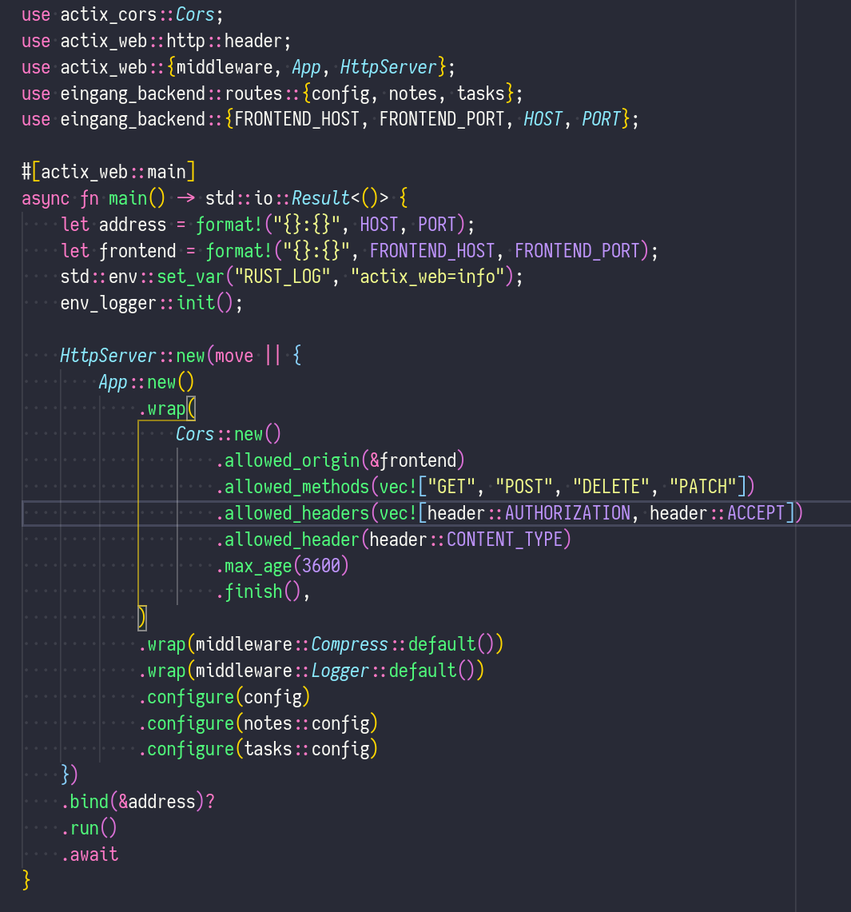
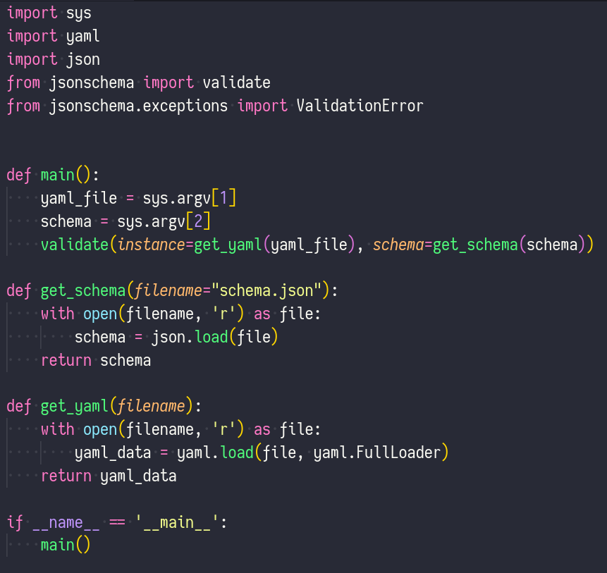
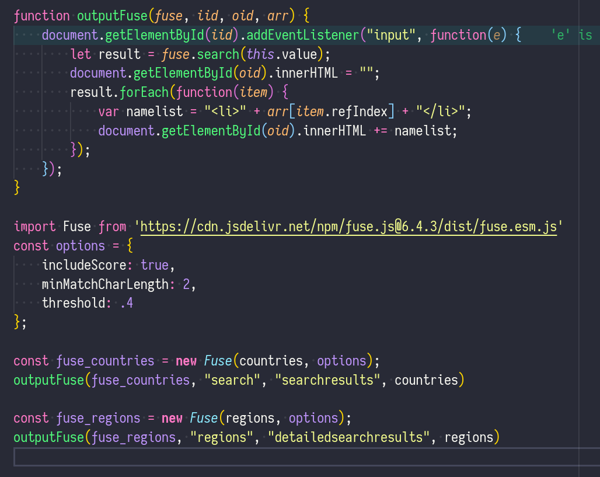
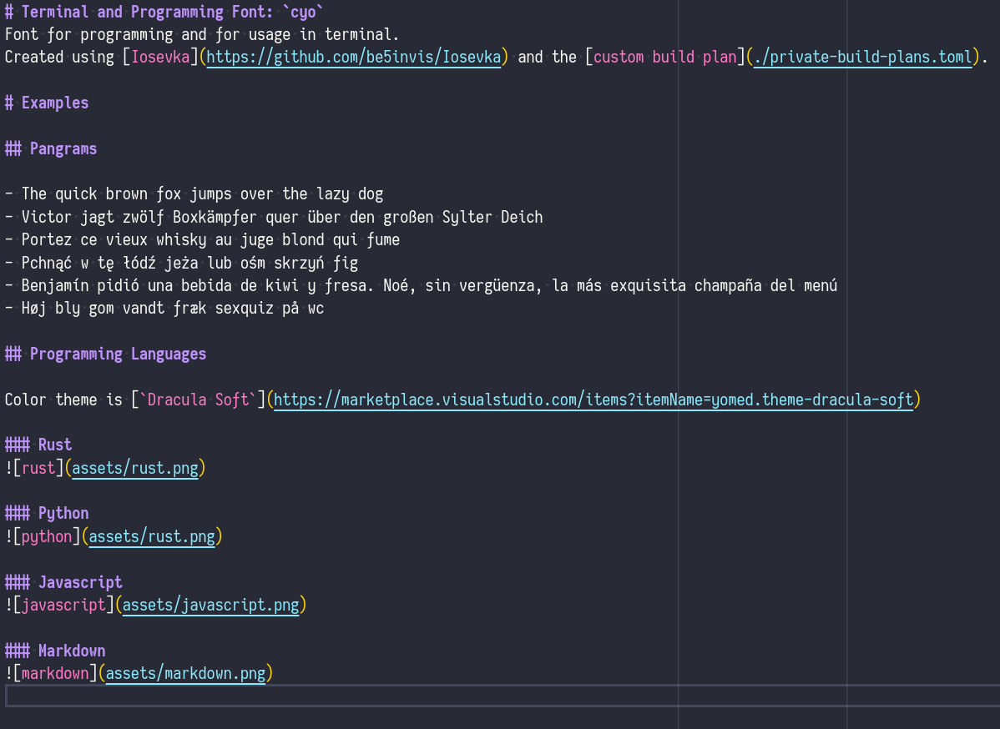

# Terminal and Programming Font: `cyo`
Font for programming and for usage in terminal.
Created using [Iosevka](https://github.com/be5invis/Iosevka) and the [custom build plan](./private-build-plans.toml).

# Examples

## Pangrams

- The quick brown fox jumps over the lazy dog
- Victor jagt zwölf Boxkämpfer quer über den großen Sylter Deich
- Portez ce vieux whisky au juge blond qui fume
- Pchnąć w tę łódź jeża lub ośm skrzyń fig
- Benjamín pidió una bebida de kiwi y fresa. Noé, sin vergüenza, la más exquisita champaña del menú
- Høj bly gom vandt fræk sexquiz på wc

## Programming Languages

Color theme is [`Dracula Soft`](https://marketplace.visualstudio.com/items?itemName=yomed.theme-dracula-soft)

### Rust

### Python

### Javascript

### Markdown

